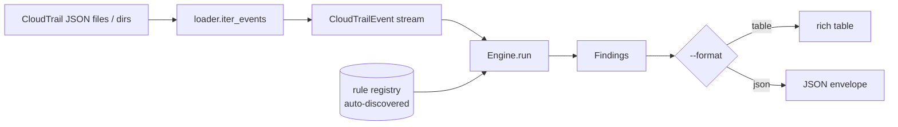

# cloudtrail-sentry

> Detect suspicious AWS activity in CloudTrail logs — offline, with an extensible rule engine, JSON + rich table output, and CI-gating exit codes.

[](https://github.com/yashlad/cloudtrail-sentry/actions/workflows/ci.yml)
[](https://www.python.org/)
[](LICENSE)
[](https://github.com/astral-sh/ruff)

`cloudtrail-sentry` reads local **AWS CloudTrail** log files and flags risky activity —
security groups opened to the internet, administrator policies attached, logging and
threat-detection disabled, public S3 buckets, root usage, logins without MFA, brute force,
and more. Each finding carries a **severity**, the **rule** that fired, the affected
**resource**, and concrete **remediation** guidance.

It makes **no AWS API calls and needs no credentials** — it analyzes files you already have.
There is nothing to leak by design.

---

## Why

CloudTrail is the system of record for "who did what" in an AWS account, but the raw logs
are high-volume and noisy. `cloudtrail-sentry` triages them the way a detection engineer
would: a catalog of rules maps risky `(eventSource, eventName)` API calls to prioritized,
actionable findings — usable ad hoc during incident response or wired into CI as a gate.

## Features

- **14 detection rules** across IAM, EC2/security groups, S3, KMS, and logging/threat-detection controls.
- **Two outputs**: machine-readable JSON (a metadata envelope, pipe-friendly for `jq`) and a colored terminal table.
- **CI-gating exit codes** — `--fail-on HIGH` exits non-zero so a pipeline fails on real findings.
- **Extensible by one file** — add a rule by dropping a module in `rules/`; auto-discovery does the rest, no central list to edit.
- **False-positive aware** — suppresses failed calls, read-only events, AWS service automation, hardening changes, and IdP-enforced-MFA logins.
- **Zero AWS credentials** — offline, file-based, no network.

## Quickstart

```bash
# From a clone (editable install with dev tools)
python -m venv .venv && source .venv/bin/activate
pip install -e ".[dev]"

# Scan the bundled example log
cts scan examples/sample_cloudtrail.json
```

## Example

```console
$ cts scan examples/sample_cloudtrail.json
```

Table output (abridged): a summary line followed by a findings table with columns
`Severity | Rule | Resource | Detail`, where *Detail* includes the remediation.

JSON output:

```console
$ cts scan examples/sample_cloudtrail.json --format json
```

```json
{
  "tool": "cloudtrail-sentry",
  "version": "0.1.0",
  "summary": {
    "events_scanned": 12,
    "findings": 3,
    "by_severity": { "CRITICAL": 1, "HIGH": 2 }
  },
  "findings": [
    {
      "rule": "CLOUDTRAIL_LOGGING_DISABLED",
      "severity": "CRITICAL",
      "resource": "org-trail",
      "remediation": "Restart logging (aws cloudtrail start-logging --name <trail>), restore the trail configuration, and investigate the principal responsible. Treat as defense evasion.",
      "title": "CloudTrail logging disabled or deleted",
      "description": "CloudTrail trail org-trail was stopped.",
      "account_id": "111111111111",
      "region": "us-east-1",
      "event_name": "StopLogging",
      "event_time": "2026-06-30T14:22:31Z",
      "source_ip": "203.0.113.47",
      "actor": "arn:aws:iam::111111111111:user/alice"
    }
    // ... 2 HIGH findings follow: IAM_ACCESS_KEY_CREATED, SECURITY_GROUP_OPEN_TO_INTERNET
  ]
}
```

> The full report (with the two HIGH findings) is checked in at
> [tests/fixtures/golden/sample_findings.json](tests/fixtures/golden/sample_findings.json).

## Verified against real AWS

Beyond the synthetic fixtures, `cloudtrail-sentry` has been run end-to-end against
**live CloudTrail logs from a real AWS account** — pulled read-only via
`aws cloudtrail lookup-events` (no changes to the tool, no stored credentials). A few
low-risk events were generated in a sandbox and the scanner flagged them exactly as
designed:

```text
Scanned 50 event(s) — 3 finding(s): 1 CRITICAL, 1 HIGH, 1 MEDIUM.

CRITICAL  IAM_ACCESS_KEY_CREATED           <user>:<access-key-id>   access key created for a different user
HIGH      SECURITY_GROUP_OPEN_TO_INTERNET  sg-xxxxxxxxxxxxxxxxx     SSH (22) exposed to 0.0.0.0/0
MEDIUM    IAM_USER_CREATED                 <iam-user>               new IAM user created
```

Account IDs, ARNs, IPs, and resource identifiers are redacted above — the tool reads
only local files and makes no AWS API calls.

## Usage

```
cts scan PATHS...            Scan CloudTrail files/directories
cts rules                    List the detection rule catalog
cts version                  Print the version
```

Key `scan` options:

| Option | Default | Purpose |
| --- | --- | --- |
| `-f, --format {table,json}` | `table` | Output format. |
| `-o, --output FILE` | stdout | Write output to a file. |
| `-s, --min-severity LEVEL` | `INFO` | Hide findings below this level. |
| `--fail-on LEVEL\|never` | `HIGH` | Exit non-zero if any finding is at/above this level. |
| `-r, --rule ID` | all | Run only these rule id(s) (repeatable). |
| `--exclude-rule ID` | none | Skip these rule id(s) (repeatable). |
| `--strict` | off | Exit non-zero on missing/malformed input. |
| `-q, --quiet` | off | Suppress warnings about skipped input. |
| `--no-color` | off | Disable ANSI colors in the table. |

### Exit codes (the CI gate)

| Code | Meaning |
| --- | --- |
| `0` | Ran clean; nothing at/above `--fail-on`. |
| `1` | Findings at/above `--fail-on` — **fail the build**. |
| `2` | Usage error (bad arguments). |
| `3` | No input found, or malformed input under `--strict`. |

```bash
# Show everything, but only fail the pipeline on HIGH or CRITICAL
cts scan ./logs/ --min-severity INFO --fail-on HIGH

# Machine output for downstream tooling
cts scan ./logs/ -f json -o findings.json

# Only the CRITICAL findings, via jq
cts scan ./logs/ -f json | jq '.findings[] | select(.severity=="CRITICAL")'
```

## Rule catalog

Run `cts rules` for the live list. v0.1 ships:

| Rule ID | Severity | Detects |
| --- | --- | --- |
| `SECURITY_GROUP_OPEN_TO_INTERNET` | HIGH / MEDIUM | Ingress opened to `0.0.0.0/0` or `::/0` on a sensitive port. |
| `IAM_ADMIN_POLICY_ATTACHED` | CRITICAL / HIGH | `AdministratorAccess` (or inline `Action:* Resource:*`) attached. |
| `IAM_ACCESS_KEY_CREATED` | HIGH / CRITICAL | Long-lived access key created (CRITICAL if minted for another user). |
| `IAM_USER_CREATED` | MEDIUM | New IAM user created. |
| `IAM_ROLE_TRUST_POLICY_MODIFIED` | HIGH / CRITICAL | Role trust opened to `*` or an external account. |
| `CLOUDTRAIL_LOGGING_DISABLED` | CRITICAL / HIGH | Trail stopped, deleted, or narrowed. |
| `GUARDDUTY_DISABLED` | CRITICAL / HIGH | GuardDuty detector deleted or disabled. |
| `AWS_CONFIG_DISABLED` | HIGH | Config recorder/delivery stopped or deleted. |
| `KMS_KEY_DISABLED_OR_SCHEDULED_DELETION` | CRITICAL / HIGH | KMS key scheduled for deletion or disabled. |
| `S3_BUCKET_EXPOSED_PUBLIC` | CRITICAL / HIGH | Bucket policy/ACL/public-access-block change exposing a bucket. |
| `ROOT_ACCOUNT_USED` | CRITICAL / HIGH / MEDIUM | Root user activity (excluding AWS-internal calls). |
| `CONSOLE_LOGIN_WITHOUT_MFA` | HIGH / MEDIUM | Successful console login without MFA (SAML/SSO-aware). |
| `CONSOLE_LOGIN_BRUTE_FORCE` | HIGH / CRITICAL | Burst of failed console logins from one source (correlation). |
| `UNAUTHORIZED_API_CALLS` | LOW → HIGH | One principal denied across many distinct actions (recon; correlation). |

Roadmap rules: `PASSROLE_TO_PRIVILEGED_ROLE`, `EC2_INSTANCE_LAUNCHED_UNUSUAL_REGION`,
`AMI_OR_SNAPSHOT_MADE_PUBLIC`, `EBS_DEFAULT_ENCRYPTION_DISABLED`.

## Architecture



Events stream lazily from the loader (gzip, JSONL, and directory recursion supported; records
de-duplicated on `eventID`). The `Engine` runs each registered rule's cheap `matches()`
pre-filter, then `evaluate()`; correlation rules (brute force, recon) buffer state and emit
from `finalize()` after the whole stream. See [docs/architecture.md](docs/architecture.md).

## Adding a rule

No central list to edit — drop one file in `src/cloudtrail_sentry/rules/`:

```python
from collections.abc import Iterable

from ..events import CloudTrailEvent
from ..models import Finding, Severity
from ..registry import register
from .base import Rule


@register
class ExampleRule(Rule):
    id = "EXAMPLE_RULE"
    title = "Example detection"
    severity = Severity.MEDIUM
    description = "What this rule detects."
    remediation = "How to fix it."
    event_names = frozenset({"SomeEventName"})

    def evaluate(self, event: CloudTrailEvent) -> Iterable[Finding]:
        if event.failed or event.is_read_only:
            return
        yield self.finding(resource="the-resource", event=event)
```

Then add a fixture under `tests/fixtures/events/` and a unit test. Done.

## Development

```bash
pip install -e ".[dev]"
pytest                 # tests + coverage (gate: 90%)
ruff check .           # lint
ruff format --check .  # formatting
mypy                   # strict type checking
pre-commit install     # enable local hooks (ruff + detect-secrets)
```

## Security & safety

- **No credentials, no network.** The tool never imports boto3 and makes no API calls.
- **Synthetic data only.** Every bundled log uses placeholder account IDs (`111111111111`),
  RFC 5737 documentation IPs (`203.0.113.x`, `198.51.100.x`, `192.0.2.x`), and fake resource ids.
- **Secrets kept out of git** via a `detect-secrets` pre-commit hook (+ baseline) and a
  `gitleaks` scan in CI. Real logs and credentials are `.gitignore`d.

## Roadmap

- SARIF output (`--format sarif`) for GitHub Code Scanning.
- Suppression/allow-list file for known-good principals and expected changes.
- The roadmap rules listed above.
- Optional live-AWS fetch (`boto3`) as an opt-in extra.

## License

[MIT](LICENSE) © 2026 Yash Lad
