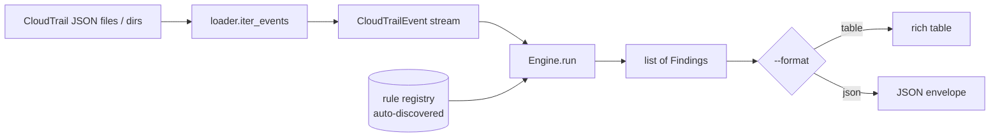

# Architecture

cloudtrail-sentry is a small, offline pipeline: **load → normalize → evaluate → render**.



## Components

| Module | Responsibility |
| --- | --- |
| `loader.py` | Read files/dirs (`.json`, `.json.gz`, `.jsonl`), unwrap the `Records` envelope, de-duplicate on `eventID`, and yield records **lazily**. Malformed input is skipped (warning) or raised under `--strict`. |
| `events.py` | `CloudTrailEvent` — flattens the common top-level fields, keeps `requestParameters`/`responseElements` as dicts, and exposes derived properties (`is_root`, `actor_name`, `mfa_authenticated`, `is_service_principal`, `succeeded`). |
| `models.py` | `Severity` (ordered `IntEnum`), `Finding` (frozen dataclass; the `rule/severity/resource/remediation` contract + optional triage context), `ExitCode`. |
| `rules/` | One `Rule` subclass per detection. `rules/base.py` defines the contract. |
| `registry.py` | `@register` decorator, package auto-discovery, and `select_rules()` filtering. |
| `engine.py` | Streams events through each rule's `matches()` → `evaluate()`, runs `finalize()` for correlation rules, filters by severity, and sorts. |
| `output/` | `json_out.py` (metadata envelope) and `table.py` (rich table); `write_report()` dispatches. |
| `cli.py` | The `cts` Typer app: `scan`, `rules`, `version`, and the CI-gating exit codes. |

## The rule model

A rule declares its identity and which events it inspects, then yields findings:

```python
class Rule(abc.ABC):
    id: ClassVar[str]
    title: ClassVar[str]
    severity: ClassVar[Severity]
    remediation: ClassVar[str]
    event_names: ClassVar[frozenset[str]] = frozenset()  # empty = all events

    def matches(self, event) -> bool: ...        # cheap pre-filter (by event_name)
    def evaluate(self, event) -> Iterable[Finding]: ...   # per-event logic
    def finalize(self) -> Iterable[Finding]: ...          # after the whole stream
```

**Stateless vs. correlation rules.** Most rules are stateless — they inspect one
event and yield findings. Correlation rules (`CONSOLE_LOGIN_BRUTE_FORCE`,
`UNAUTHORIZED_API_CALLS`) accumulate state across `evaluate()` calls and emit from
`finalize()`. Because `all_rules()` returns a **fresh instance per scan**, holding
state on `self` is safe.

## Auto-discovery (why adding a rule needs no wiring)

`registry.discover()` walks every module in `cloudtrail_sentry.rules` with `pkgutil`
and imports it, which runs the `@register` decorators. So a new rule becomes active
the moment its file exists — there is no central list, switch statement, or plugin
manifest to update. The `test_registry.py` meta-test then enforces that every
registered rule has a well-formed id, title, remediation, and severity.

## False-positive handling

Detection logic is deliberately conservative:

- **Failed calls** (`errorCode` present) and **read-only** events never trigger
  mutation rules — the state change did not happen. (`UNAUTHORIZED_API_CALLS` is the
  deliberate exception; it is *built on* `errorCode`.)
- **Hardening isn't flagged**: setting S3 Block Public Access all-true, or an
  `UpdateTrail` that keeps multi-region logging, produce nothing.
- **Scoped grants**: a wildcard-principal bucket policy with an `aws:SourceIp` /
  `aws:PrincipalOrgID` condition is treated as intentional.
- **AWS automation**: actions by `AWSService` principals or service-linked roles
  (`AWSServiceRoleFor…`) are suppressed.
- **Federated MFA**: SAML/SSO logins report `MFAUsed:"No"` even when the IdP enforces
  MFA, so those are excluded from the no-MFA rule.

## Performance

Events are streamed, never fully materialized, so a multi-gigabyte log flows through
with bounded memory. Each rule's `matches()` is an O(1) set membership check, so only
relevant events reach the heavier `evaluate()` logic.
